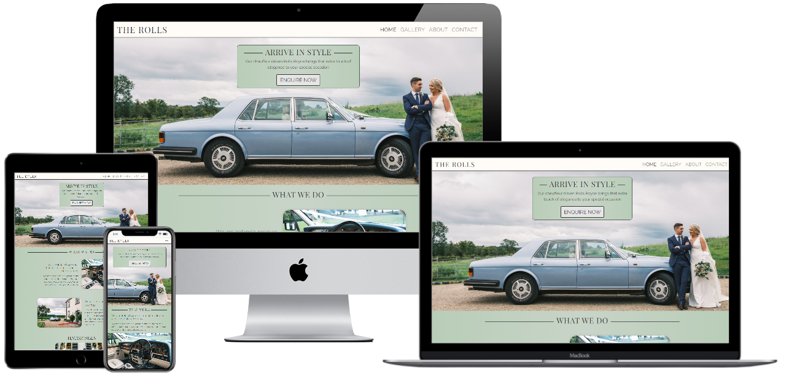
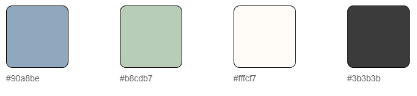

    

 
 
# Table of Contents
 
- [Project Overview](#project-overview)
 
- [UX Design](#ux-design)
 
    - [Strategy](#strategy-plane)
    - [Scope](#scope-plane)
    - [Structure](#structure-plane)
    - [Skeleton](#skeleton-plane)
    - [Surface](#surface-plane)
 
- [Features](#features)
 
- [Technologies Used](#technologies-used)
 
- [Testing](#testing)
 
- [Deployment](#deployment)
 
- [Credits](#credits)
 
# Project Overview
 
This project is for Milestone 1 of the Code Institute Full Stack Developer Course. The purpose of the project is to develop a static front-end site to present useful information to users, using mainly HTML & CSS.
 
“The Rolls” is a fictitious Irish company that provides a chauffeur driven luxury classic car for weddings and other special events. Customers will be able to view the car, find out more about the service provided, and make booking enquiries on the site to check availability. 
 
The site can be viewed [here](https://pmcgrenery.github.io/ms1-the_rolls/).
# UX Design
 
## Strategy Plane
 
### **The Business Goals:**
-   Create an online presence for the company where users can easily access information on the service.
-   Develop more booking leads for the business.
-   Present the brand and the service offered as a high-end, luxury product and evoke a sense of timeless elegance.
-   Primarily target the website at the lucrative wedding market, while making it clear the service can be booked for other occasions.
 
### **Target Clients:**
-   Couples organising their weddings. Typically 25-45 years old.
-   Parents looking to buy a wedding gift for their Son or Daughter. Typically 50-70 years old.
-   People looking to book a chauffeured car for a special occasion. Variable ages.
 
### **Tech considerations:**
-   The service is targeted at users of varying ages and varying technical ability, so it is important that the site is easy to use and navigate. 
-   As the target users are of varying ages and degrees of tech savviness, the user should have the option to make a booking enquiry by phone, email or enquiry form.
 
### **User Stories:**
-   As a visitor to the site I want to see what services you provide.
-   As a potential customer I want to see what the car looks like inside and out, so I know exactly what I would be paying for.
-   As a potential customer who is interested in booking your service I want to know how much it costs, so I know if it is within my budget before spending time making an enquiry.
-   As an interested customer I would like a link to your social media accounts, so I can see more photos and follow you.
-   As a customer who has decided to go ahead and book the service, I want to make a booking enquiry.
-   As a potential customer I would like to see your customer testimonials, so that I will feel more confident about booking the service.
-   As a potential customer I want to find out more about your company, so that I can get to know more about your company ethos.
 
### **Competitor Review:**
[VintageWeddingCars.ie](http://www.vintageweddingcars.ie/)
 
- Pros: 
    -   A well-presented, responsive site with good images and all of the information needed.
    -   Simple contact options.
- Cons: 
    -   The “We Recommend” section adds unnecessary complexity to the site and could potentially lead to users being distracted and led away from the site.
    -   No pricing information.
 
[KPCD.ie](https://www.kpcd.ie/)
 
- Pros:
    - Good contact options
- Cons:
    - Information overload. Far too much information on each page. This gives a very poor UX and likely leads to a loss in booking enquiries.
    - No pricing information.
 
[VolksWeddings.ie](https://www.volksweddings.ie/)
 
-   Cons:
    -   Poor responsiveness.
    -   Inconsistent sizing, spacing and borders of images.
    -   Very poor navigation.
    -   Poor placement of contact options.
    -   No pricing information.
 
### **Scope Plane**
 
The following must be incorporated:
-   The ability to easily make contact for a booking enquiry via phone, email, and online form.
-   A responsive design that will present the information in a logical format on all devices.
-   Easy and intuitive to navigate.
-   The content describing the service must be clear and concise while avoiding information overload.
-   Appropriate images to primarily target the wedding market and to show the service provided.
-   Appropriate branding and colour palette for the business.
 
What could be incorporated?
-   An online booking system could be incorporated in the future but will not be added at this time.
-   A testimonials section that takes in the latest reviews from Facebook and displays in a carousel.
-   An Enquiry form that gives different input options depending on the occasion the user is booking for.
 
### **Structure Plane**
 
The structure of the site follows standard conventions. Each page has the same basic structure:
 
-   Navigation bar across the top with simple horizontal layout. Displayed as a burger menu on smaller devices.
-   Main body of the page containing the relevant content.
-   Footer at the bottom of the page containing site links and social media.
 
The website is broken into four different pages:
 
•   **Home**
This page will clearly outline what the company offers and why you would choose The Rolls.
 
•   **About**
This page will tell the user a bit more about the company ethos, the car and information on the pricing.
 
•   **Gallery**
This page will have a gallery of the promotional photographs.
 
•   **Contact**
This page will have details on how to contact the company for a booking enquiry.
 
 
### **Skeleton Plane**
 
[Home Page Wireframes](./assets/images/homepage-wireframe.png)
 
[About Us Wireframes](./assets/images/about-wireframe.png)
 
[Gallery Wireframes](./assets/images/gallery-wireframe.png)
 
[Contact Wireframes](./assets/images/contact-wireframe.png)
 
### **Surface Plane**
 
The project's overall aesthetic is designed to align with the company's ethos and branding and evoke a sense of calm, elegance, trustworthiness and simplicity.
 
#### Logo:
 
Instead of creating a logo I chose to keep it simple and implement the site logo using HTML and CSS so that it scales well across different devices. 
 
#### Colour Scheme:
The colour scheme was chosen to evoke certain emotions appropriate to this business. According to a [verywellmind.com article](https://www.verywellmind.com/color-psychology-2795824) on colour psychology:
 
- Blue evokes: Stability, calm, trustworthiness, professionalism
- Green evokes: Calm, optimism, security
- White evokes: Cleanliness, peacefulness, simplicity
- Black evokes: Sophistication
 
I chose to use green and white as the two main colours of the site and then allow the blue to come from the images of the car on the site.
 
The colour of the car is a washed out blue so I chose to complement that with a similarly washed out green. The white chosen is an off white to add some warmth to the site as I felt pure white made the site appear a little cold. The text is a dark grey rather than black to bring some warmth and to complement the washed out colours of blue and green.
 
Where the green is used as a background it has been implemented with a very subtle linear gradient, with a darker green to the sides and a slightly brighter green to the center. This is done to give a subtle focus on the content in the center of the page and improve readability.
 
Specifically, the main colours used are:
 

 
#### Typography:
Google fonts were used for all of the fonts on the site.
 
- Playfair Display at regular font weight was chosen for the brand logo and main headings. Playfair is an elegant serif typeface well suited for titles and headlines. Its classical style lends itself to the company ethos of timeless elegance.
 
- Raleway at font weight 300 was chosen as the text for the main body and subheadings. Raleway is an elegant sans-serif typeface. To add an extra touch of elegance I chose to use a light weight. I found that any lighter than weight 300 reduced readability considerably.
 
- Italianno was chosen for the Henry Rolls quote section. Italianno is a cursive typeface, chosen for its elegance. 
 
#### Images:
 
The images used on the majority of the site are my own images, taken by David McClelland. The images were chosen to highlight the service provided.
 
The images of couples in the testimonial section are royalty free images from pexels.com.
 
#### Animations:
 
The animations used are for the quote section of the about, the navigation links and the buttons. 
 
- A slide in from the left transition and a fade in transition are used for the quote section. The animations are implemented using [animate.css](https://animate.style/).
 
- An underline from the center on hover animation is used for the navigation links. This was done to increase the interactiveness of the site and improve UX. The animation is implemented using [hover.css](https://ianlunn.github.io/Hover/).
 
- The 'Enquire Now' buttons are implemented using [Bootstraps built in button class](https://getbootstrap.com/docs/4.0/components/buttons/). When the button is interacted with the button changes to a darker colour and gets a shadow around the edge. As with the nav links this improves interaction with the user.

- The carousel on the gallery page has a crossfade transition from one image to the next. This animation is done using [Bootstraps built in carousel class](https://getbootstrap.com/docs/5.0/components/carousel/).

The animations were modified in the style.css file to tailor the elements for this site.

# Features
 
The site has the same basic layout for each page.
 
The site is responsive to all screen sizes. This is done using [Bootstrap’s flexbox grid system](https://getbootstrap.com/docs/5.0/getting-started/introduction/) with its different responsive tiers. 
 
Each page is split into different sections and they appear either stacked or side by side, depending on the screen size, as per the wireframes.
 
- Header
 
    - The header sits to the top of each page.
    - The header is a sticky header that remains in place at the top of the screen when the user scrolls down to allow easy navigation no matter where the user is on the site.
    - The company logo will sit to the left of the header on all devices.
    - The site navigation links sit horizontally to the right on all devices except smartphones.
    - The navigation links are underlined from the center when hovered over. Implemented using [hover.css](https://ianlunn.github.io/Hover/). This improves the UX.
    - On smartphones the navigation links collapse down into a burger menu. The burger menu sits to the right of the header. This is done using [Bootstrap's collapsible navbar](https://getbootstrap.com/docs/5.0/components/navbar/). The links sit to the right hand side when the burger menu is pressed on.
 
- Main Body
 
    - The main body of each page contains the relevant content, in the form of images and text, for each page. The elements on the page are made responsive to different screen sizes using [Bootstrap's grid system](https://getbootstrap.com/docs/5.0/layout/grid/). The details of each page is laid out below.
 
- Footer

    - Social media links in the form of icons inside a circular div. The icons are [FontAwesome Icons](https://fontawesome.com/icons?d=gallery). The background colour changes to green when hovered over with a 0.2 second ease in and out transition.
    - Company address.
    - Copyright fine print.
 
- Features specific to each page
 
    - Home
        - Leads with a hero image overlaid with a call to action in the form of a booking enquiry button. The button links to the Contact page. The call to action is placed and sized in such a way as to allow the user to see the main focus of the image underneath regardless of the screen size. The hero image itself changes in size depending on the screen size, again to ensure the callout is an appropriate size while allowing the user to see the main focus of the image behind.
        - A ‘What we do’ section to communicate to the user straight away the kind of service that is provided by the company. The information appears as per the wireframes depending on the screen sizes. The images take up the full width of the screen on small devices. On medium devices and larger the images appear with rounded edges to reference old photographs with rounded edges.
        - A 'Testimonials' section with 3 reviews from previous happy customers. The testimonials are in a [Bootstrap carousel](https://getbootstrap.com/docs/5.0/components/carousel/). It is a slide type carousel with a 10 second interval timer. I chose to present the reviews in a carousel so that a larger image could be included and to improve the interactiveness of the site to provide a better UX.
    - Gallery
        - Promotional Images of the service provided in a [Bootstrap carousel](https://getbootstrap.com/docs/5.0/components/carousel/). The carousel used is a crossfade carousel with an interval timer set at 5 seconds. By using this feature the user will not see the images loading one by one as they would if they were presented in a masonry design for example. This is done to promote a better UX and encourage user interaction.
        - The picture takes up the full width of the screen up to medium screen sizes so the user can get as large a view as possible of the images. On screens medium and larger, the images appear with a rounded edge to maintain consistency with the way images were presented on the home page.
        - Below the image carousel there is a booking enquiry button that stands out to the user. This button links to the contact page.
    - About
        - A quote from Henry Royce to convey to the user the company ethos. The quote slides in from the left and the author fades in after the quote has stopped and the user has had a chance to read the quote. This is done using [animate.css](https://animate.style/).
        - An ‘About Us’ section to tell the user a little bit more about the company and the company ethos.
        - An ‘About the car’ section to give more detail on the car specifications etc.
        - A 'Pricing' section to show the approximate price of the service. Below the text detailing the price there is a google map in an iframe to show the user the approximate cost in the defined areas. The iframe is manipulated to hide the cumbersome and unsightly bar across the top of personal google maps that comes as standard.
    - Contact
        - The page leads with an image of the car to keep consistency across the pages.
        - A wedding enquiry form with various input types to get the necessary information from the interested user. As the business is primarily targeted at weddings, the inputs are aligned to that need. All inputs are required except for the message input and phone number. A [Bootstrap form](https://getbootstrap.com/docs/5.0/forms/overview/) was used to implement this element. The phone number has a pattern attribute applied to it to require 10 or more numbers.
        - A section that gives the email address and phone number to allow the users to make contact this way if they prefer or to just ask a question.
        - The email and phone number details are links that automatically open the applicable app on the users device.
        
# Technologies Used
## Languages Used
- HTML5
 
- CSS3
 
## Frameworks, Libraries, Programs and Online Tools Used
 
- **[Animate.css](https://animate.style/)**. Used for the slide in and fade in animations.
 
- **[Hover.css](https://ianlunn.github.io/Hover/)**. Used for the underline from the center animation on the nav links.
 
- **[Font Awesome](https://fontawesome.com/)**. Used for the phone, email and quote icons.
 
- **[Bootstrap V.5](https://getbootstrap.com/docs/5.0/getting-started/introduction/)** Used throughout the project.
 
- **[Google Fonts](https://fonts.google.com/about)** Used for all of the fonts that appear on the site.
 
- **[Google Chrome Dev Tools](https://developers.google.com/web/tools/chrome-devtools)** Used extensively to test the responsiveness of the site.
 
- **[Google maps](https://www.google.com/maps/d/u/1/?hl=en)**. Used for the embedded map.
 
- **[Balsamiq](https://balsamiq.com/)** - Used to create wireframes
 
- **[Gitpod](https://gitpod.io/)** - Used to code HTML & CSS
 
- **[GitHub](https://github.com/)** Used as a code repository and to host the site.
 
- **[Resizing.app](https://resizing.app/features/resize-png/)** - Used to resize images for quicker loading.
 
- **[Favicon.io](https://favicon.io/favicon-generator/)** - Used to create the simple favicon image.
 
- **[Cssgradient.io](https://cssgradient.io/)** Used to create color gradient background
 
- **[WAVE Accessibility Tool](https://wave.webaim.org/)** Used to check the accessibility of the site.
 
- **[Autoprefixer CSS Online](https://autoprefixer.github.io/)** Used to check for css prefix omissions to ensure cross browser compatibility.
 
# Testing
 
Details of the testing carried out can be viewed in a separate [TESTING.md file](TESTING.md)
 
# Deployment
## How the project was deployed on GitHub Pages.
 
The project was coded in Gitpod, committed to Git and pushed to GitHub. The project was deployed from its Github repository using GitHub Pages. 
 
The steps to deploy the site to GitHub pages are as follows:
 
1. Login to Github.
2. Select the pmcgrenery/ms1-the_rolls repository.
3. On the top tab, select "Settings".
4. Scroll down to the "GitHub Pages" section.
5. Under source, select "Master" from the dropdown selection.
6. A second dropdown appears, ensure "/(root)" is selected.
7. Press the ""Save" button. The page will refresh.
8. Scroll back down to the "GitHub Pages" section. In the blue section under the heading you will find the link to the deployed site.
 
## How to run the project in GitPod.
 
1. Download the [Chrome Web Browser](https://www.googleadservices.com/pagead/aclk?sa=L&ai=DChcSEwjE05jL-IfvAhUY6-0KHVj0DRcYABABGgJkZw&ohost=www.google.com&cid=CAESQOD24xYvSkhGMwiKLgK3CrSybtFeT6R-oG_css2y6Lu6XGzyepb2ghN57ehHJkpg6_HSncFxVG78IwXHmXdD1q4&sig=AOD64_2PC1Ooz3rD0sq4NbhSvetwGzaCuw&q=&ved=2ahUKEwj40ZHL-IfvAhVAaRUIHQXoBT0QqyQoAHoECAsQEw&adurl=).
2. Download the [Chrome GitPod](https://www.gitpod.io/docs/browser-extension/) browser extension.
3. Create a [Github Account](https://github.com/join).
4. Log in to [GitPod](https://gitpod.io/login/), using your GitHub account details.
5. Navigate to [The Rolls Github repository](https://github.com/pmcgrenery/ms1-the_rolls).
6. Click on the green "Gitpod" button at the top of the repository above the file explorer.
7. Gitpod will load for you in a new tab.
8. The ReadMe file will be presented initially, you can navigate to the source code using the explorer on the left hand side.
9. To display the site frontend in a separate browser tab, enter "python3 -m http.server" into the terminal at the bottom of the screen and press Enter.
10. A notification will appear at the bottom right of the screen, click on Open Browser.
 
## How to run the project on a local machine.
 
1. Navigate to [The Rolls Github repository](https://github.com/pmcgrenery/ms1-the_rolls).
2. Click on the Code dropdown above the file explorer.
3. Under Clone, select the "HTTPS" option.
4. Copy the URL presented.
5. Open your local IDE.
6. Open the terminal
7. Create a directory where you would want this repository to be stored.
8. Type "git clone" and paste the URL in that you previously copied.
9. Press Enter and your local clone repository will be created.
 
For further information on how to clone a repository from GitHub click [here](https://docs.github.com/en/github/creating-cloning-and-archiving-repositories/cloning-a-repository).
For further information on how to clone a repository into your IDE please consult your providers documentation.
 
# Credits
## Content
The content on the site is my own and written by me. However, it should be noted that [vintageweddingscars.ie](http://www.vintageweddingcars.ie/) was used for overall inspiration on what should be included.
 
## Media 
[Pexels.com](https://www.pexels.com) . Used for the three royalty free stock photos in testimonials section.
 
All other images are owned by me. Photographer: [David McClelland](https://davidmcclelland-photography.com/)
 
## Animations
 
[Animate.css](https://animate.style/) This external css file was used for the slide in and fade in animations used for the Henry Royce quote.
 
[Hover.css](https://ianlunn.github.io/Hover/) This external css file was used for the underline from center animation used on the navigation links.
 
## Code 
[How to Online](https://www.howtoonlinetips.com/hide-google-map-top-bar-embedded-header/). Used inspiration from the code on this site to hide the header on the embedded google map.
 
[Sympli.io](https://sympli.io/blog/heres-everything-you-need-to-know-about-favicons-in-2020/) Used the code on this blog to implement the favicon images on different devices.
 
[Bootstrap V.5](https://getbootstrap.com/docs/5.0/getting-started/introduction/) Template code from the documentation on Bootstrap 5 was used to implement the responsiveness, navbar, carousel throughout the site. The code was heavily modified to suit this site.
 
[Stack Overflow](https://stackoverflow.com/questions/5214127/css-technique-for-a-horizontal-line-with-words-in-the-middle). Code from this post was used to place the horizontal lines beside the headings.
 
[Animate.css](https://animate.style/). Code from the documentation section of this library was used to modify the timing of the animations.
 
[Sympli.io](https://sympli.io/blog/heres-everything-you-need-to-know-about-favicons-in-2020/). Code from this site was used as a guide to implement the favicon images on different devices.
 
[Autoprefixer CSS Online](https://autoprefixer.github.io/) The output code from this automated test was used to correct the code that was already written by me.