

  
 
# Table of Contents
 
- [User Story Testing](#user-story-testing)

- [Manual Testing](#manual-testing)
    - [Header](#Header)
    - [Footer](#footer)
    - [Home Page](#home-page)
    - [Gallery Page](#gallery-page)
    - [About Page](#about-page)
    - [Contact Page](#contact-page)
    - [404 Page](#404-page)
- [Bugs](#bugs)
- [Browser Testing](#browser-tests)
- [Automated Testing](#automated-testing)
    - [Google Lighthouse](#google-lighthouse)
    - [WAVE Tools](#wave-tools)
    - [W3C HTML Validator](#W3C-html-validator)
    - [W3C CSS Validator](#W3C-css-validator)
    - [Autoprefixer](#autoprefixer)
    - [A11y Color Contrast Checker](#a11y-color-contrast-checker)
 
# Testing
## User Story Testing
### **As a visitor to the site I want to see what services you provide.**
1. A user who initially lands on the site instantly sees the hero image of a wedding couple beside the car with ribbons on the bonnet. This immediately gives the impression of what the service offered is.
2. The user sees the callout that gives a brief description of the service, further reinforcing the initial impression given with the hero image.
3. On the landing page the user can see a "What we do" section.
4. An "About Us" page on the site goes into more detail on the service provided if the user wants to find out more.

 

### **As a potential customer I want to see what the car looks like inside and out, so I know exactly what I would be paying for.**
1. The hero image on the home page gives the first impression of this.
2. The What We Do section of the home page presents 2 more pictures of the car.
3. The user can follow the navigation to the gallery page to see the entire collection of pictures of the car.
4. Each page of the site leads with a picture of the car, so that no matter what page the user lands on initially they will get an impression of the car.

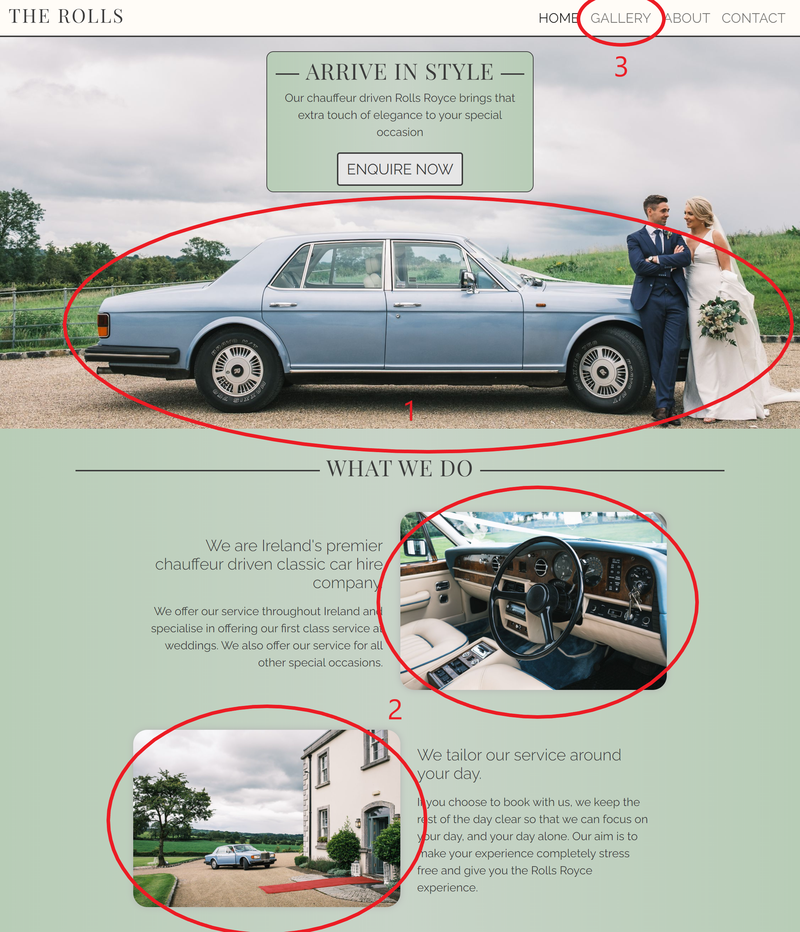
 
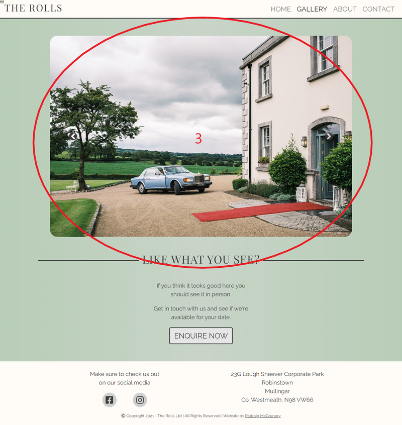
 
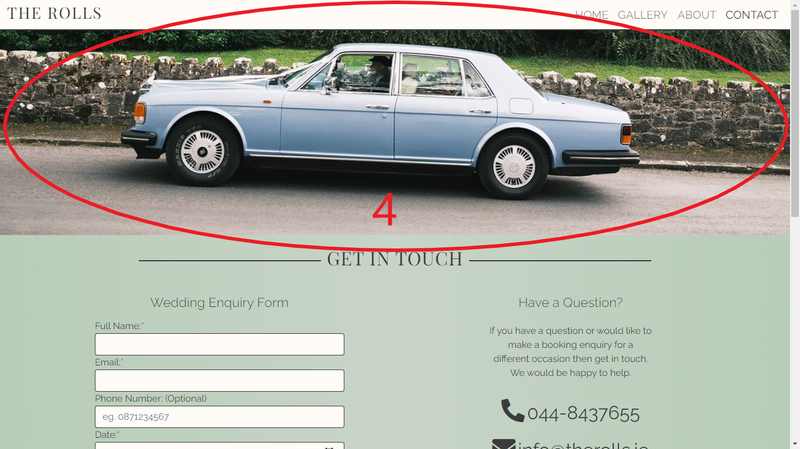
 

### **As a potential customer who is interested in booking your service I want to know how much it costs, so I know if it is within my budget before spending time making an enquiry.**
1. The user will find this information in the About page.
2. It is made clear to the user that the prices listed are estimated prices based on the location of their event and that they should get in contact to get an accurate quote.

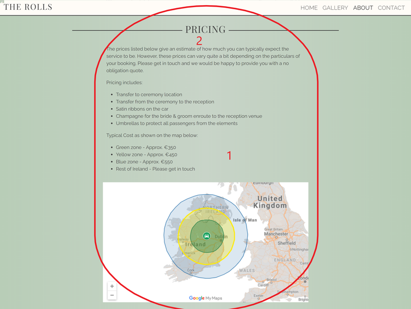
 

### **As an interested customer I would like a link to your social media accounts, so I can see more photos and follow you.**
1. The user will find these links in the footer of each page. 
2. It is conventional to have the social media links at the bottom of the page even if they appear elsewhere on the page. So the user who typically uses social media will instinctively know where to find the links.
 
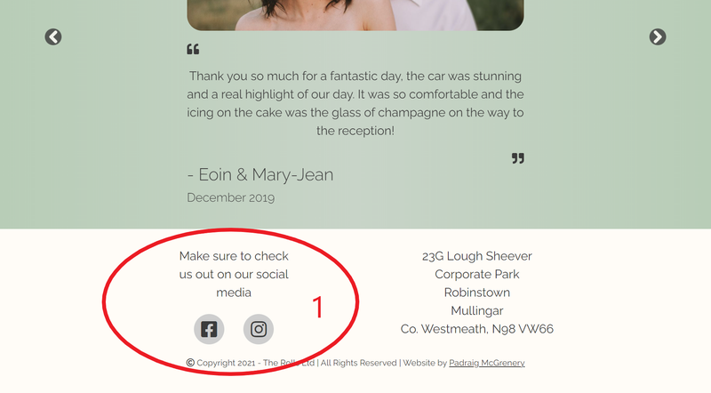
 

### **As a customer who has decided to go ahead and book the service, I want to make a booking enquiry.**
1. The user will find enquire buttons on the home page and the gallery page. They can also navigate to the contact page by the navigation links in the header which feature on all pages.
2. The buttons link to the contact page where the user can make an enquiry.
3. The user can make an enquiry by submitting an enquiry form.
4. The user can make an enquiry by phone or email.
5. If the user chooses to enquire using the  online form they will receive a prompt if they fail to fill out all applicable fields.
6. When the form is submitted successfully the user recieves a thank you message in a modal so that they recieve feedback for the action they have taken.
7. The enquiry form is geared to the main clientele of this business which is for weddings. If the user wants to book for a different event they can enquire by email or phone.
8. The phone and email links are made large to create the impression of them being links.
9. The phone and email links automatically open the applicable app on the users device when pressed.

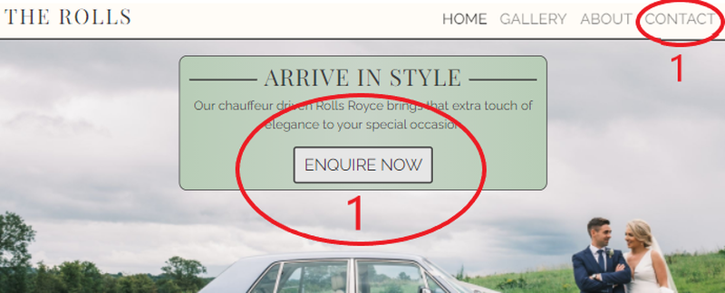
 
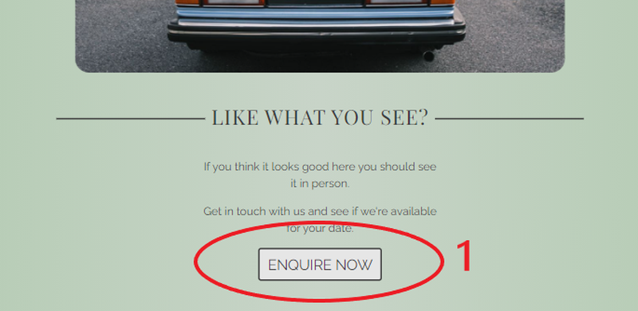
 
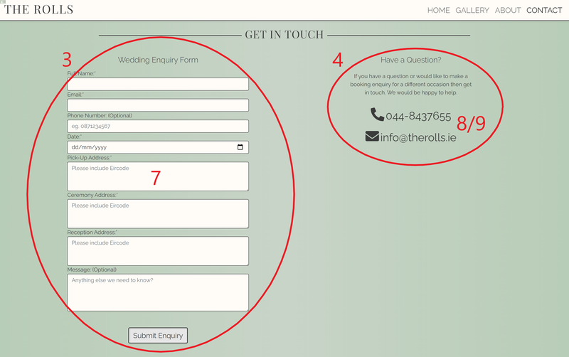
 
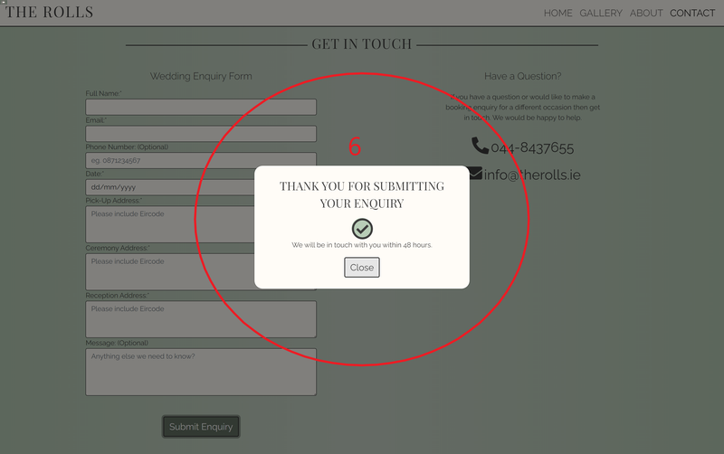
 
 
### **As a potential customer I would like to see your customer testimonials, so that I will feel more confident about booking the service.**
1. The user will find these on the home page towards the bottom of the page. It is conventional to have testimonials to the bottom of a page so the user will know instinctively to look here.
2. There is a picture of the couple to increase the trust of the user in the testimonials.

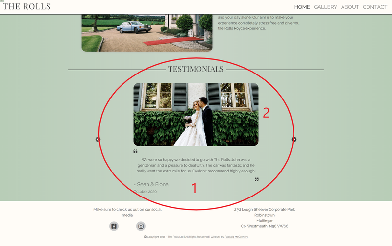
 

### **As a potential customer I want to find out more about your company, so that I can get to know more about your company ethos.**
1. On the main page the user will find out a short bit of information on the company in the What We Do section.
2. The user can navigate to the About page where they will find out more about the company, the car and the pricing.
3. The testimonials tell the user a little bit about the company from a third person perspective.
4. Pictures paint a thousand words, so the website is littered with images of the service provided.

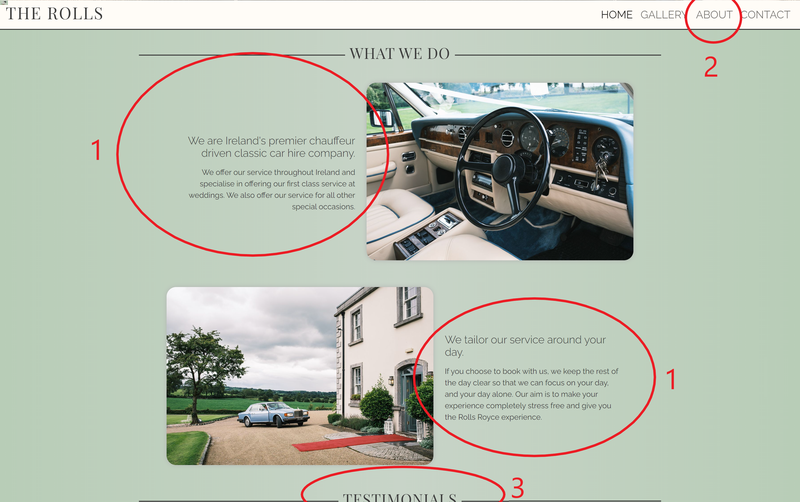
 
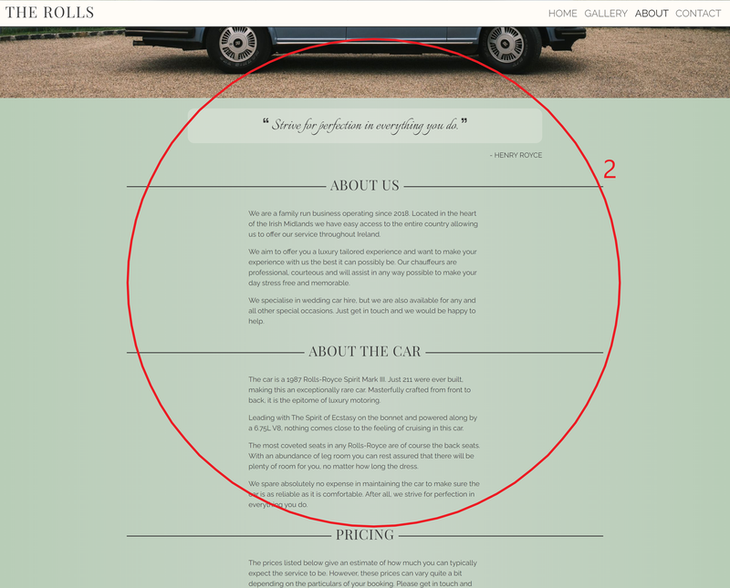
 

## Manual Testing

The following elements and sections were tested using Chrome Developer Tools.

Chrome's built in screen size emulator was used to test the site on different screen sizes. All of the elements listed in this manual tesing section were tested on the following screen sizes:

| Viewport Size (px)| Description | Bootstrap Breakpoint |
| -------------- |-------------| -----------------|
| 320 x 568 | iPhone5/SE in Portrait | XS |
| 375 x 667 | iPhone 6/7/8 in Portrait | XS |
| 568 x 320 | iPhone 5/SE in Landscape | SM |
| 667 x 375 | iPhone 6/7/8 in Landscape | SM |
| 768 x 1024 | iPad in Portrait | M |
| 1024 x 768 | iPad in Landscape | L |
| 1280 x 800 | Common Laptop | XL |
| 1366 x 768 | Common Laptop | XL |
| 1440 x 900 | Macbook Pro 15 | XXL |
| 1920 x 1080 | Common Large Desktop Monitor | XXL |
| 2560 x 1440 | 5K desktop monitor  | XXL |

### Header
- The navigation links were tested to ensure that they work correctly on each page.
- Checked that the logo brand links to the home page from each page.
- Checked the navigation links work on smaller devices when the navbar collapses to a burger menu.
- Checked the underline from the left works on each link on each page and does not extend beyond the writing itself.
- Checked the current page relates to the correct link and that the applicable link appears slightly heavier than the other links.
- Checked the navigation links stay to the right on both small and large devices.
- Checked the header collapses to a burger menu at a point that allows the nav links to be accommodated comfortably before they collapse.
- Checked that the burger menu icon appears to the right on the smallest devices.
- Checked that the navigation links and logo have a font size that appears in proportion when viewed on large devices.
- Checked that the burger menu, when pressed, diplays the links and hides the links when pressed a second time.
- Checked the header appears the same size on all pages.
- Checked that pressing tab logically brings you from left to right.

<figure>
 
<figcaption>Header on a desktop</figcaption>
</figure>
 
<figure>
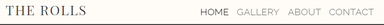 
<figcaption>Header on a tablet</figcaption>
</figure>
 
<figure>
 
<figcaption>Header on a mobile</figcaption>
</figure>
  

### Footer
 
- Checked that the social media links work and open in new tab.
- Checked the responsiveness of the footer on each page for all screen sizes.

<figure>
 
<figcaption>Footer on a desktop</figcaption>
</figure>
 
<figure>
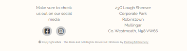 
<figcaption>Footer on a tablet</figcaption>
</figure>
 
<figure style="display:block">
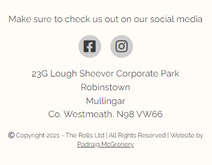 
<figcaption>Footer on a mobile</figcaption>
</figure>
 

### Home Page
 
- Ensured the callout appears above the car and above the couple in the picture on all screen sizes so that the main focus of the image is visible on all screen sizes.
- Ensured the image is such that the fold is always visible on all screen sizes below the hero image to encourage users to scroll down.
- Ensured the callout is an appropriate width on all screen sizes.
- Ensured the text is legible on all screen sizes.
- Ensured the text in the What We Do section is aligned towards the image on medium screen sizes and above.
- Ensured the images in the What We Do section take up the full screen width on x-small devices.
- Ensured the images in the What We Do section were stacked as per the wireframes on medium devices and larger.
- Ensured variable padding and margins depending on screen size to make the information more presentable worked correctly.
- Checked the forward and backwards buttons on the image carousel worked.
- Checked the interval timer allowed enough time to read each testimonial.
- Ensured the quote icons in the testimonials appeared on their own line and to the start and end of the quote.

<figure>
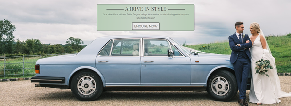 
<figcaption>Homepage Hero Image on a desktop</figcaption>
</figure>
 
<figure>
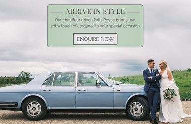 
<figcaption>Homepage Hero Image on a tablet</figcaption>
</figure>
 
<figure>
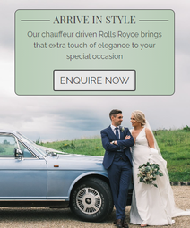 
<figcaption>Homepage Hero Image on a mobile</figcaption>
</figure>
 
<figure>
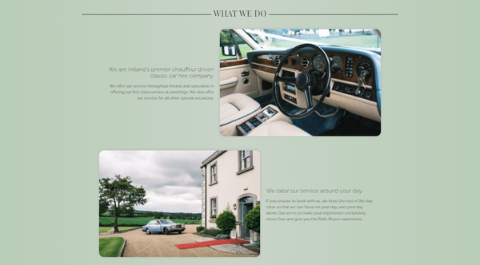 
<figcaption>Homepage What We Do on a desktop</figcaption>
</figure>
 
<figure>
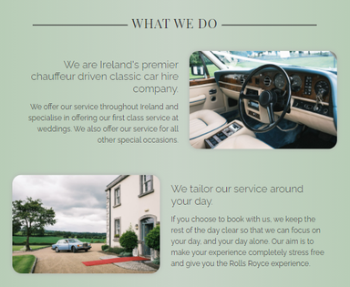 
<figcaption>Homepage What We Do on a tablet</figcaption>
</figure>
 
<figure>
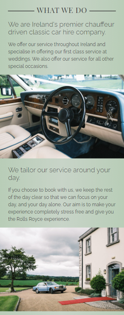 
<figcaption>Homepage What We Do on a mobile</figcaption>
</figure>
 
<figure>
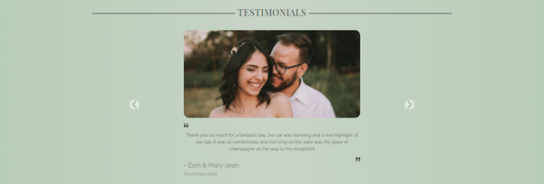 
<figcaption>Homepage Testimonial on a desktop</figcaption>
</figure>
 
<figure>
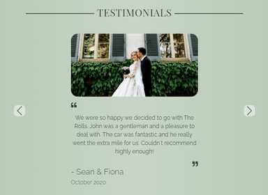 
<figcaption>Homepage Testimonial on a tablet</figcaption>
</figure>
 
<figure>
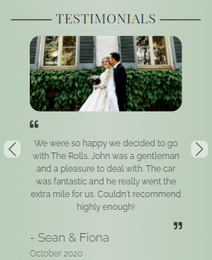 
<figcaption>Homepage Testimonial on a mobile</figcaption>
</figure>

### Gallery Page
 
- Checked the carousel took up the full width of medium sized devices and smaller.
- Checked the gallery images appeared as intended on larger devices.
- Checked the interval timer was set to 5 seconds on all images.
- Checked the image quality was good on all device sizes while balancing load times.
- Checked the Enquire Now button linked to the Contact page
- Ensured all text on the page was centered on all screen sizes.
- Checked the carousel forward and back buttons worked.

<figure>
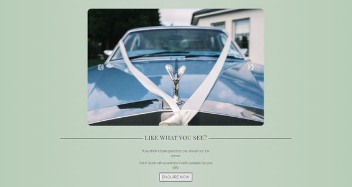 
<figcaption>Gallery on a desktop</figcaption>
</figure>
 
<figure>
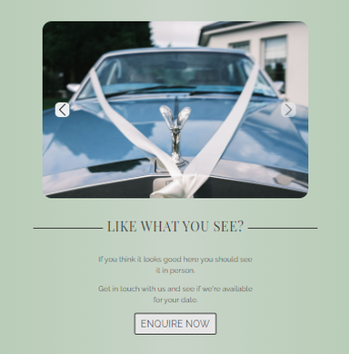 
<figcaption>Gallery on a tablet</figcaption>
</figure>
 
<figure>
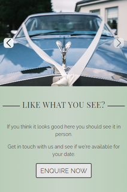 
<figcaption>Gallery on a mobile</figcaption>
</figure>

### About Page
 
- Checked the image at the top of the page appear correctly on all screen sizes.
- Checked each section had its own row.  
- Checked the slide in from the left animation worked and was timed correctly.
- Checked the fade in animation worked and was timed correctly.
- Checked the timings of the animations.
- Ensured the top of the iframe was hidden to hide the google map menu bar on all screen sizes.
- Ensured the bottom of the iframe was hidden to hide the google map scale and T&C's text on all screen sizes.
- Checked the map could be zoomed in and out and could be easily navigated.
- Checked the 2 finger zoom worked on touchscreen devices.
- Ensured the google map colour was appropriate to the website and in keeping with the theme.
 
<figure>
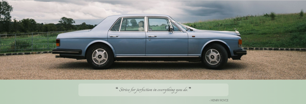 
<figcaption>Lead image and quote section on a desktop</figcaption>
</figure>
 
<figure>
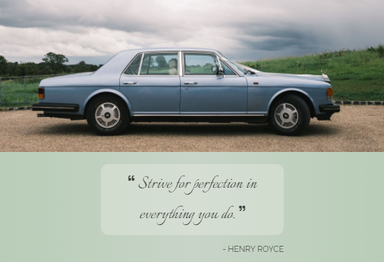 
<figcaption>Lead image and quote section on a tablet</figcaption>
</figure>
 
<figure>
 
<figcaption>Lead image and quote section on a mobile</figcaption>
</figure>
 
<figure>
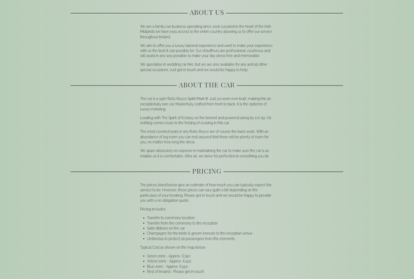 
<figcaption>About section on a desktop</figcaption>
</figure>
 
<figure>
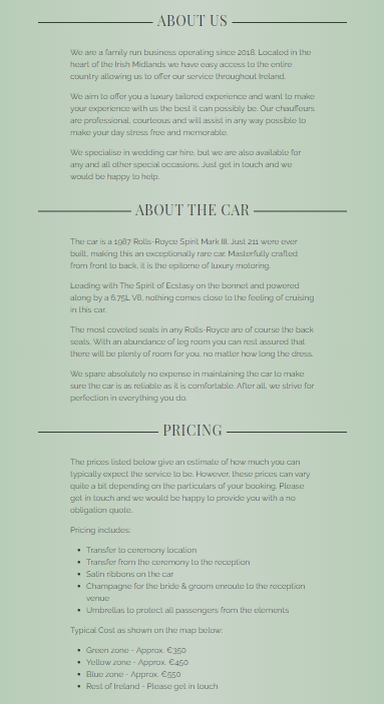 
<figcaption>About section on a tablet</figcaption>
</figure>
 
<figure>
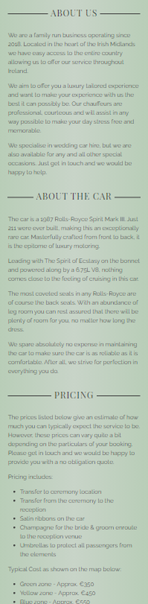 
<figcaption>About section on a mobile</figcaption>
</figure>
 
<figure>
 
<figcaption>Embedded Google Map on a desktop</figcaption>
</figure>
 
<figure>
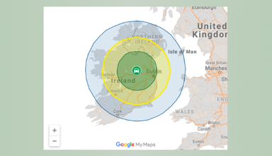 
<figcaption>Embedded Google Map on a tablet</figcaption>
</figure>
 
<figure>
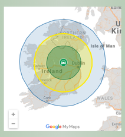 
<figcaption>Embedded Google Map on a mobile</figcaption>
</figure>
 

### Contact Page
 
- Checked the image at the top of the page appear correctly on all screen sizes.
- Checked that the enquiry form appeared first above the contact details on medium devices and smaller.
- Checked that each input field on the form was given a shadow when the field was being interacted with.
- Checked each input field would only take the appropriate data. eg email will only take an email etc.
- Checked the calendar button works on various devices so users can select dates rather than have to write them.
- Checked the required fields worked correctly and wouldn't allow a form submit without being filled.
- Checked the phone number input would not accept any less than 10 digits.
- Checked the phone number does not accept letters.
- Checked the form could not be submitted before the required fields were filled out.
- Checked the modal is brought up only after the form has been successfully been submitted.
- Checked the data inputted on the form automatically clears when the form has been successfully submitted.
- Ensured the contact details appeared to the right hand side, as intended, on large devices.
- Checked the phone number opened the appropriate app on all devices when pressed.
- Checked the email address opened the appropriate app on all devices when pressed.

<figure>
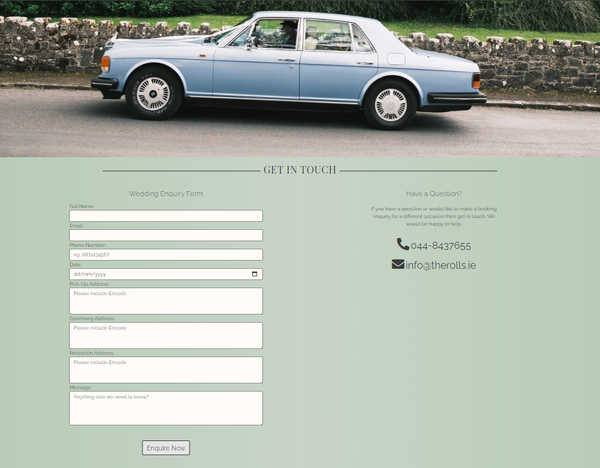 
<figcaption>Contact page on a desktop</figcaption>
</figure>
 
<figure>
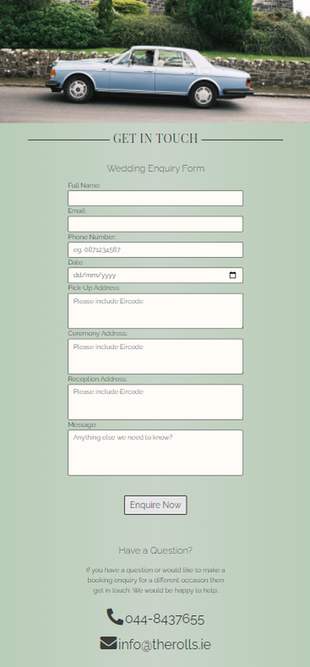 
<figcaption>Contact page on a tablet</figcaption>
</figure>
 
<figure>
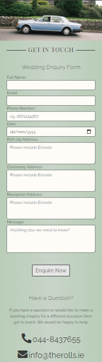 
<figcaption>Contact page on a mobile</figcaption>
</figure>
 

### 404 Page

- Checked the 404 page appeared when any url other than those that exist in the project are entered. eg https://pmcgrenery.github.io/ms1-the_rolls/information.html
- Checked the link to the home page returns the user to the home page as intended.
- Checked the 404 page appears as intended on all device sizes.

<figure>
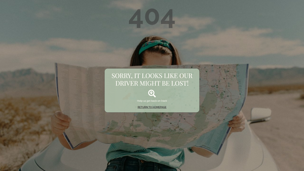 
<figcaption>404 page on a desktop</figcaption>
</figure>
 
<figure>
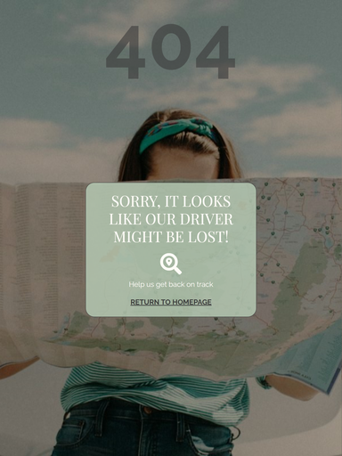 
<figcaption>404 page on a tablet</figcaption>
</figure>
 
<figure>
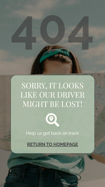 
<figcaption>404 page on a mobile</figcaption>
</figure>
 

## Bugs
 
1. Bug found: The underline from the left extended well beyond the text when the nav links were used in the burger menu.
    - Fix: 

        1.Moved the <code>hvr-underline-from-center</code> class from the <code>li</code> parent to the actual <code>a</code> link on all pages.
    
        2.Added code to make the <code>nav-link</code> sit over to the right of the drop down menu by applying <code>float:right</code> on screen sizes XS(less than 576px).
 
        3.Added code to remove the margins from the <code>hvr-underline-from-center:before</code> on screen size XS(less than 576px).
 
2. Bug found: The navigation link for "Home" was appearing heavier in the header on all pages as the code had been copied across to each page from the index.html.
    - Fix: Moved the <code>active</code> class in the navbar <code>a</code> links to the correct link.
 
3. Bug Found: By default the links in the nav burger menu appear to the left side of the screen on xs screens.
    - Fix: The original fix was to apply <code>text-align:end</code> to the <code>header-nav a</code>. However, this became obsolete when the underline bug above was found. So to make the links appear to the right hand side the fix was as detailed in the underline issue detailed above.
 
4. Bug found: The social media links opened in the current browser tab.
    - Fix: Added <code>target="_blank"</code> attribute to the links.
 
5. Bug found: The social media icons in the footer squeeze in on top of eachother on medium screen sizes.
    - Fix: Changed the bootstrap class to <code>justify-content-around</code> to move the 2 icons apart and made alterations to the bootstrap <code>col</code> class that the links are displayed in.
 
6. Bug found: On screen size medium, the image and text on the 2nd row of the What We Do section did not appear as intended on the wireframe.
    - Fix: I needed to change the order of the image and text but only on screen size medium and above. To do this I used Bootstrap's <code>order-md-#</code> class which defines the order of the relevant <code>div</code> on screen sizes medium and larger.
 
7. Bug found: The text and pictures in the What We Do section appeared too close together on medium screens and larger.
    - Fix: I applied Bootstrap's responsive margins and padding to achieve the desired spacing on medium sized screens and larger. For example, <code>px-md-4</code> was added to the class for the text articles in order to push the image and the text apart on screen size medium and larger.

8. Bug Found: The carousel controls on the testimonial section were too far from the content on large screens.
    - Fix: I changed the width of the div containing the control icons on larger devices to push the icons in towards the center of the page.

9. Bug Found: When the site was tested on friends and family, some found it hard to see the previous and next icons for the carousels. Some users also suggested the icons were too far apart on large screens.
    - Fix: To overcome this issue I inserted a custom icon image to replace the standard Bootstrap icon to allow the icon to stand out. I also forced the icons on the testimonial carousel towards the middle of the page on larger screens as per user suggestions.
 
10. Bug Found: I initially had the "Thank You" modal triggered by simply pressing the "Submit Enquiry" button. But I realised during testing that the modal was presented regardless of whether the form was filled out or not. To fix this I needed to include code that only lets you submit the form once the form has been filled correctly.
    - Fix: In order to do this I included javaScript that listens out for the submit event on the enquiry form. As the form cannot be submitted unless the form is filled out correctly, this acted as the initial filter to check if the form has been filled out properly or not. Once the submit event takes place, then the code will run and present the modal.

11. Bug Found: Originally the form did not reset the values after the form was submitted. I found this gave a poor UX and created the impression to the user that the information had not been submitted.
    - Fix: I included code in the snippet of javaScript that resets the form after the form has been successfully submitted.

12. Bug Found: The modal fontawesome icon has a circular div behind it, for some reason the div overflows the icon despite the fact that the icon is 50px wide , and the div is 48px wide.
    - Fix: After some experimenting I applied <code>transform: translate(-2px,-2px)</code> to the icon to move it relative to the div to fix the issue.

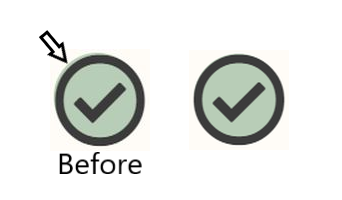

## Automated Testing
 
The site was tested using the following validators and online tools:
 
### Google Lighthouse
Based on initial results from Google Lighthouse the following changes were made to the site:
 
- Added a Meta description to each page.
- Added a 'rel="noopener"' attribute to the social media links to improve security.
- Text colour in the Enquire button on the callout lacked sufficient colour contrast so that was changed to the same colour as the rest of the text and the background changed to a silver colour.
- Converted images from jpg to jp2 in order to improve first contentful paint time.
- Added a Meta Theme color.
- Added a title to the iframe google map for accessibility.
- Added an Apple touch icon and subsequently included favicon images.
 
<figure>
    

        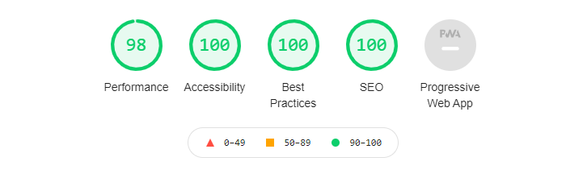
    

</figure>
<figcaption style="text-align:center">Lighthouse Test Results after changes were made</figcaption>
 
### WAVE Tools
Bases on initial results from the web accessibility tool the following were added:
- Fixed the order of headings so that the site will make more sense to users.
- Added an aria-label to divs with a picture in the background to improve accessibility.
- Fixed the aria-current page attribute in the header navbar to relate to the correct pages.
 
There are 2 redundant link alerts on the WAVE tool remaining:
- The Logo brand in the header and the Home navigation link are duplicate links and lead to the same page. As the navigation bar collapses to a burger menu on smaller screens I decided to keep the Logo brand as a link so that the user can easily navigate to the home page without having to open the burger menu.
- The Enquire Now button on the home page and the gallery page are duplicates of the Contact navigation link. As the buttons are calls to action I decided to keep the links as they are.
 
<figure>
    

        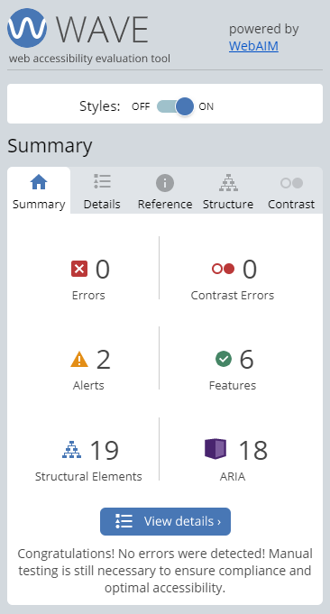
    

</figure>
<figcaption style="text-align:center">WAVE Test Results after changes were made</figcaption>
 
### W3C HTML validator
[W3C HTML Validator](https://validator.w3.org/) yielded the following issues:
- Issues mainly related to the use of incorrect semantic markup.
    - Fix: To overcome this I changed the semantic markup of the files to clear the warnings.
- Erroneous addition of <code>type="textarea"</code> attribute to the textareas in the form on contact.html. 
    - Fix: These were deleted to remove the error.
- An issue with the iframe map which originally had an attribute of <code>width="100%" height="450"</code>. 
    - Fix: The width attribute should have a pixel value and not a % value. To overcome this I modified style.css for <code>map-inner</code> to add <code>width:100%</code> and <code>height:470px</code> and removed the width and height attributes from the iframe.
 
### W3C CSS validator
[W3C CSS Validator](https://jigsaw.w3.org/css-validator/) yielded no issues. 
 
### Autoprefixer
 
[Autoprefixer CSS Online](https://autoprefixer.github.io/) was used to check for any issues relating to prefixes in the CSS code. The test revealed prefix omissions relating to the linear gradients used for the background and the box shadows applied to some images and buttons. These omissions were corrected and no issues were found.
 
### A11y Color Contrast Checker
 
[A11y Color Contrast Accessibility Validator](https://color.a11y.com/Contrast/) Used to check the contrast of the colors to ensure the site is accessible. No issues were found and the actual contrast ratios well exceeded the accepted standards.

<figure>
    

        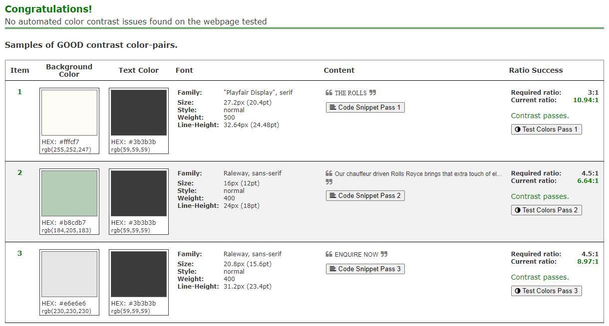
    

</figure>
<figcaption style="text-align:center">A11y Color Contrast Results</figcaption>